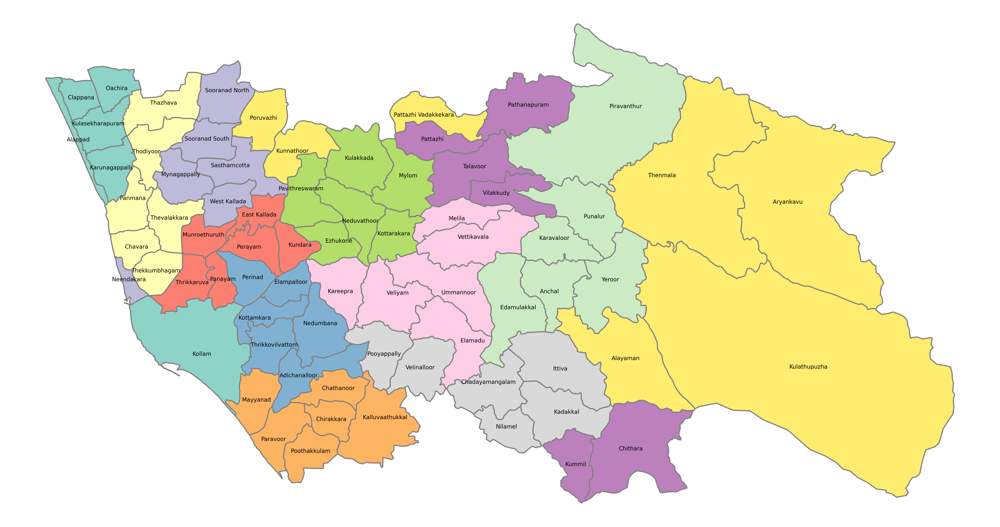
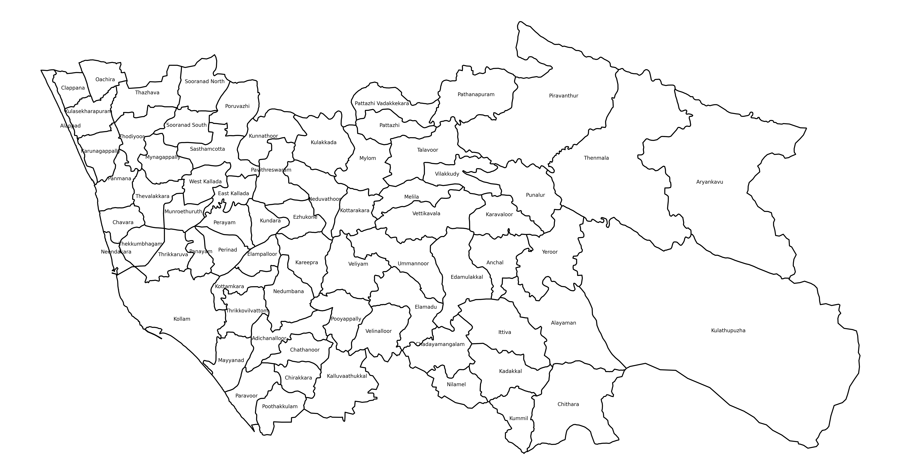

# Kerala-Panchayath-Maps
Python project to generate Kerala's distrcit level panchayath map.


As of now, geojson files of Kollam and Kozhikode are added to the folder `geojson_files`. So other districts won't work.

### Usage 

1. Install requirements using 

    ```pip install -r requirements.txt ```

2. Run the below command:

    ```python map_generator.py -d Kollam -f png -c True```
    
    Here `-f` and `-c` are optional arguements. 
    
    For details on arguements, run:
    
    ```python map_generator.py -h```
    
    output:
    
	>    		optional arguments:
	>            		-h, --help            show this help message and exit
	>  
	>            -d DISTRICT, --district DISTRICT
	>                        District name
	>                        
	>            -f FORMAT, --format FORMAT
	>                        Output image format (default: png)
	>                        
	>            -c CMAP, --cmap CMAP  
	>                    If coloured map is required, use True. else use False.(default : True)
	>  
	    
    
4. Map file is generated in `maps` folder.

### Sample Map

#### Coloured Map



#### Black and White Map



### Generate GeoJson from OpenstreetMap

- goto [Overpass](http://overpass-turbo.eu/) and use the code below:

```
    [out:xml][timeout:500];
    {{geocodeArea:Kozhikode district}}->.searchArea;
    (
        nwr["boundary"="local_authority"]["admin_level"="8"](area.searchArea);
    );
    // print results
    out meta;
    >;
    out meta qt;
```

change district name to desired one.

- If you know the OSM area code of the district, use the following code in [Overpass](http://overpass-turbo.eu/)

```
    [out:xml][timeout:500];
    area(3602018247)->.searchArea;
    (
    nwr["boundary"="local_authority"]["admin_level"="8"](area.searchArea);
    );
    // print results
    out meta;
    >;
    out meta qt;
```

Please use the exact OSM district name or OSM area code from the table below:

| District | OSM District name | OSM ID |
|--------- | ----------------- | ------ |
| Kannur |  Kannur district | 3602018247 |
| Kasaragod |  Kasaragod district | 3602018248 |
| Kollam | Kollam | 3602018154 |
| Kottayam | Kottayam | 3603743996 |
| Kozhikode |  Kozhikode district | 3602018249 |
| Malappuram | Malappuram | 3602018186 |
| Palakkad | Palakkad | 3601819321 |
| Pathanamthitta | Pathanamthitta | 3602018176 |
| Thiruvananthapuram | Thiruvananthapuram | 3601818784 |
| Thrissur |  Thrissur district | 3602018177 |
| Wayanad | Wayanad | 3602018203 |
| Alappuzha | Alappuzha | 3603743889 |
| Ernakulam |  Ernakulam district | 3603740342 |
| Idukki | Idukki | 3601819274 |


### References

1. [https://wiki.openstreetmap.org/wiki/Local_Bodies_in_Kerala](https://wiki.openstreetmap.org/wiki/Local_Bodies_in_Kerala)
2. [http://overpass-turbo.eu/](http://overpass-turbo.eu/) http://overpass-turbo.eu/
3. [https://opendatakerala.org/](https://opendatakerala.org/) https://opendatakerala.org/
4. Various solved answers from [Stack Overflow](https://stackoverflow.com/)
